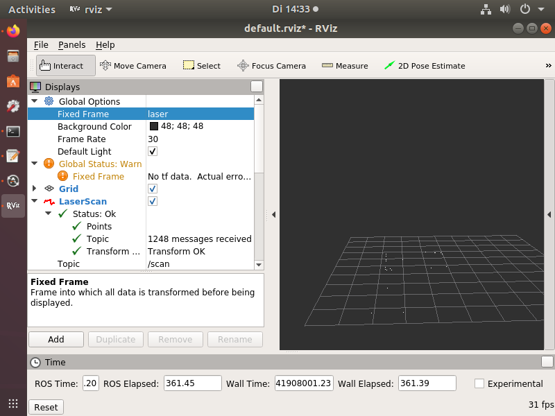

# Table of contents
<!-- TOC -->
- [Table of contents](#table-of-contents)
- [How to](#how-to)
    - [Build and install](#build-and-install)
    - [Creating a new workspace](#creating-a-new-workspace)
    - [Connect to a workspace](#connect-to-a-workspace)
- [Special Cases](#special-cases)
    - [Enable GUI applications inside workspace](#enable-gui-applications-inside-workspace)
    - [Edit your workspace without connecting to workspace](#edit-your-workspace-without-connecting-to-workspace)
- [Tutorials](#tutorials)
    - [Running SICK laserscanner with DROS](#running-sick-laserscanner-with-dros)
<!-- /TOC -->


# How to

## Build and install

First of all you need to install Docker on your platform. Follow the [instructions](https://docs.docker.com/engine/install/) for your platform.

If you successfully installed Docker you can continue with the following steps.


1. Clone the repository
```bash
git clone https://github.com/PointlessBox/dros
```

2. Install `build`:
```bash
pip install build
```

3. Navigate into project directory:
```bash
cd dros
```

4. Build project:
```bash
python -m build
```

5. Install project
```bash
pip install dist/dros<some stuff>.whl
```

6. Test installation:
```bash
dros --help
```

## Creating a new workspace

1. Create a directory where you want to place your workspace in. This folder is just the place where your workspace data will be saved into. It is not your final workspace:
```bash
mkdir some_dros_ws
```

2. Navigate into this directory
```bash
cd some_dros_ws
```

3. Create new workspace with an appropriate name. For this example we will create a 'turtlebot' project workspace. By passing the `--path` option we can tell DROS to use a specific directory where our data should be placed in. In this case we create the directory 'turtle'. We can also specify the ROS version to use by using the `--ros-version` option. In this case it's 'melodic':
```bash
dros new turtlebot --path=turtle --ros-version=melodic
```

You can check if your workspace got created by using `dros list`.

**That's it. You created your first DROS workspace!**


## Connect to a workspace

To connect to a workspace you need to use the following command:
```bash
dros connect <workspace_name | index>
```

You can get a list of all workspaces by using `dros list` which will give you an output like this:
```
[0] turtlebot
```

Now you can connect to your workspace by either passing the workspace name (e.g. 'turtlebot') or the index (e.g. '0') to `dros connect`:
```bash
dros connect turtlebot
```

You can also use a more comfortable way by using the `--select` flag without the `workspace` argument, which gives you a list of workspaces and then prompts you to select one.

**Now you got a shell inside your workspace and you can start your project!**


# Special Cases


## Enable GUI applications inside workspace

1. Open a terminal on your host environment

2. Type `xauth version` into your terminal to check if it is installed. If it is not installed go ahead and install it.

3. List your auth entries with `xauth list`. You should get an output similar to this:  
`myuser/unix:0  MIT-MAGIC-COOKIE-1  158**************************1a8`

4. Copy the output from your terminal.

5. Connect to your DROS workspace by using the `connect` command.

6. Type in the following command in the connected terminal:  
`xauth add <insert copied entry from step 3 and 4>`

7. Now you should be able to start GUI Applications from inside your workspace.

<mark>**You will probably need to redo this process after a system or workspace restart.**</mark>


## Edit your workspace without connecting to workspace

1. Open a terminal in your host environment and navigate to the folder containing your 'catkin_ws' folder.

2. Type in the following command:  
`sudo chown <your username>:<your username> -R catkin_ws`  
This will change the ownership of all folders and files to the given user.

3. Now you are able to modify your workspace from your host environment.

<mark>**After using the `reinit` command or after using `catkin_make` you will have to redo this process, because the ownership will be reset to the root user of the workspace environment.**</mark>


# Tutorials

## Running SICK laserscanner with DROS

Before yor start this tutorial, be sure to enable GUI Applications in your workspace by following the associated tutorial.

1. Create a new workspace with name 'sick-ws'

2. Connect to workspace 'sick-ws'

3. Create a 'src' folder in your catkin_ws if it does not exists yet.

4. Clone the following repositories into '~/catkin_ws/src':  
`https://github.com/ros-drivers/sicktoolbox`  
`https://github.com/ros-drivers/sicktoolbox_wrapper`

5. Run the following command:  
`catkin_make install`  
If there is an error about a package named 'diagnostic_update', then run the following command:  
`sudo apt-get install ros-<your ros distro>-diagnostics`  
Now run `catkin_make install` again.

6. Now make sure you got read/write permissions on the associated USB device by running `sudo chmod a+rw /dev/ttyUSB0`

7. Now open two additional terminals and connect them to your DROS workspace 'sick-ws'.

8. In the first terminal tun `roscore`  
In the second terminal run  
`rosrun sicktoolbox_wrapper sicklms _port:=/dev/ttyUSB0 _baud:=38400`  
In the third terminal run `rosrun rviz rviz`.  
You should now have a window running the RViz Visualizer.

9. Now configure the visualizer to display the scanner data like so:
